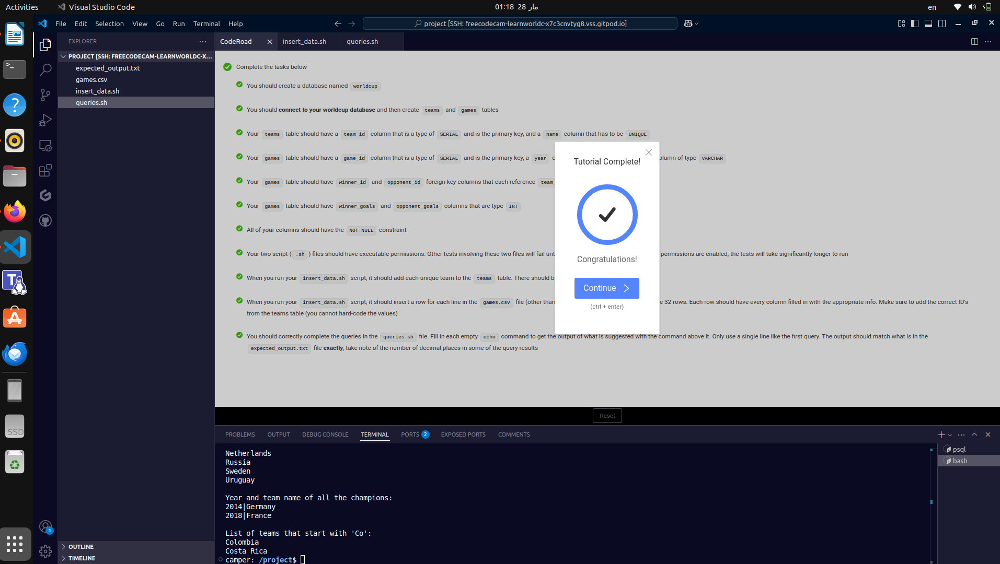

World Cup Database

This project is a PostgreSQL database that stores information about the final three rounds of the FIFA World Cup tournaments since 2014. It includes data about teams, matches, and scores.
How to Use

    Create the database and restore the structure by running:

psql --username=freecodecamp --dbname=postgres -f worldcup.sql

Insert data into the database by executing:

./insert_data.sh

Run queries to retrieve insights from the database:

    ./queries.sh

Completion Proof

Below are the images confirming the successful completion of this project:

Insert Data Script

Insert Data Execution

This project was completed as part of the freeCodeCamp Relational Database Certification. 🚀
