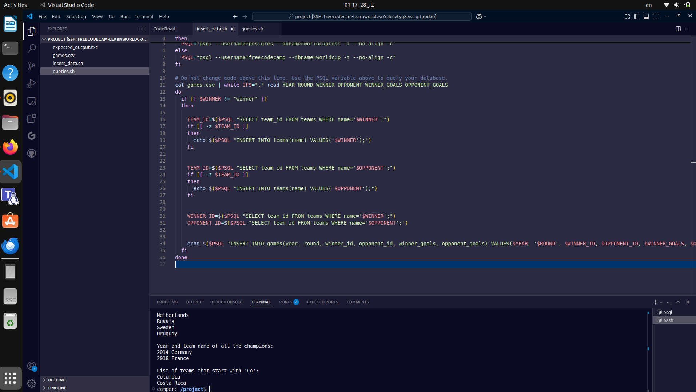
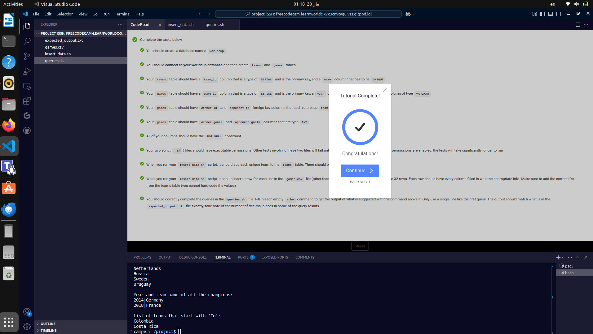

# World Cup Database

This project is a **PostgreSQL database** that stores information about the final three rounds of the **FIFA World Cup** tournaments since **2014**. It includes data about teams, matches, and scores.

## How to Use
1. **Create the database** and **restore the structure** by running:
   ```sh
   psql --username=freecodecamp --dbname=postgres -f worldcup.sql
   ```
2. **Insert data** into the database by executing:
   ```sh
   ./insert_data.sh
   ```
3. **Run queries** to retrieve insights from the database:
   ```sh
   ./queries.sh
   ```

## Completion Proof
Below are the images confirming the successful completion of this project:

   
  
 

---

This project was completed as part of the **freeCodeCamp Relational Database Certification**. 🚀
